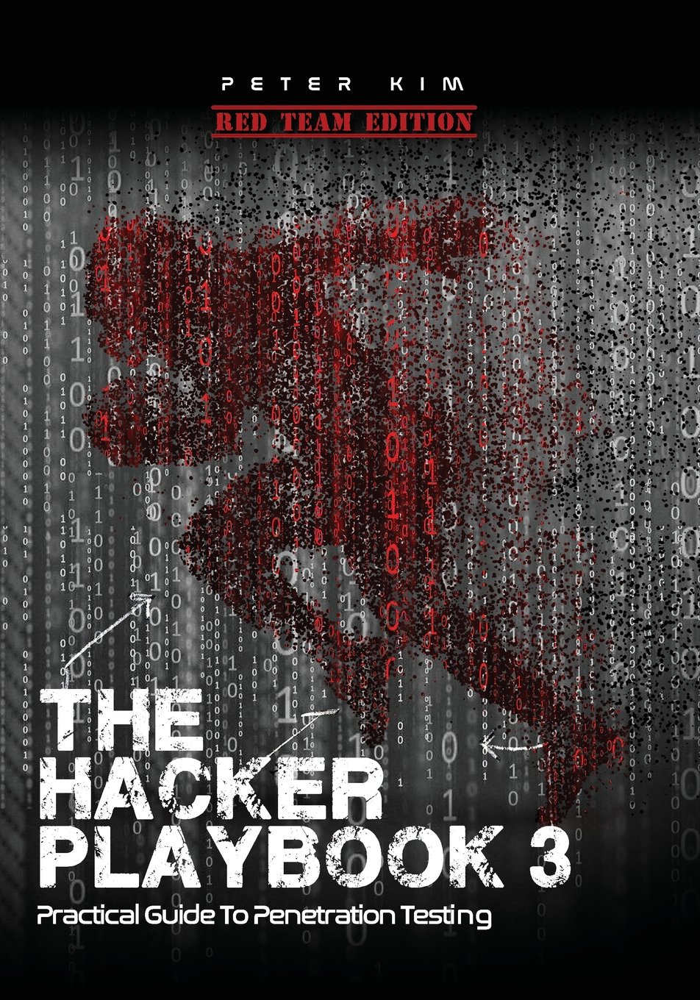

# [译] 渗透测试实战第三版(红队版)

- 译者：[Snowming](https://github.com/Snowming04)（雪茗）  时间：北京时间 2019-03-17
- 本书英文名：The Hacker Playbook 3

## 阅读及 PDF 下载
[在 Github 上阅读本书](https://github.com/Snowming04/The-Hacker-Playbook-3-Translation/blob/master/SUMMARY.md)
[PDF 下载](https://github.com/Snowming04/The-Hacker-Playbook-3-Translation/blob/master/PDF/%5B%E8%AF%91%5D%20%E6%B8%97%E9%80%8F%E6%B5%8B%E8%AF%95%E5%AE%9E%E6%88%98%E7%AC%AC%E4%B8%89%E7%89%88(%E7%BA%A2%E9%98%9F%E7%89%88).pdf)

## 免责声明
[@Snowming](https://github.com/Snowming04) 纯粹出于学习目的与个人兴趣翻译本书。本人承诺绝不用此译文谋取任何形式的经济利益。也坚决拒绝其他任何人以此牟利。

本译文只供学习研究参考之用，不得用于商业用途。[@Snowming](https://github.com/Snowming04) 保留对此版本译文的署名权及其它相关权利。

若有人使用本译文进行侵权行为或者违反知识产权保护法的任何行为，与本译者无关。译者坚决反对此类行为。

**任何转载必须注明出处。**

## 译者的话
这本书是 `The Hacker Playbook` 的第三版，通常我们也说它是红队版。因为本书是以红蓝对抗中红队的视角来撰写的。

首先要说一声抱歉，因为我的翻译可能并不是特别好。首先，整本书是在三周的时间仅由我一个人翻译完的，因为本人临近硕士毕业，不可能花太多时间来作这件事情。而且这本书的专业程度比较高，并不是一本科普读物。而译者的专业水平有限，所以可能对本书的理解上也受限于我的专业水平。但是，译者尽力以最大的诚意，来完成此书的翻译。我寻求的效果是：完成本书作者与中文读者之间的连接。基于此目标，我的**翻译原则**有以下几条:
1. 对每一个句子，我并非在词义的层面上简单的译为中文,而是按照自己的理解翻译的。我有一种观点：如果那样的话，与谷歌翻译有什么区别呢？所以我会在词义的基础上，去理解作者的每一句话，查阅相关资料，结合词义、句意、专业知识背景来翻译。所以读者可以看到，我在一些地方贴出了一些补充资料。我希望我的翻译既保留作者原意，也更符合中文。其中若有不明之处，我跟几位比我从业经验丰富的安全行业朋友进行了讨论，毕竟我资历尚浅，若是因为自己的肤浅理解而误导读者，那可真是我的过错了。对每一个句子，只有我自己让我是可以读懂的，我才会贴上来。
2. 因为中文和英文的确存在差异，并非每一句英文的意思都可以用中文完全表达出同样的意思，不可避免的存在些个翻译出来比较奇怪的词语。对于这种情况，我会去互联网上基于关键词进行搜索，参考诸如微软中文文档之类的翻译，最好是遵循他们的翻译惯例。因为毋庸置疑的，专业的微软文档工程师肯定比我的水平高。
3. 译文中所有的链接我自己都点过一遍，虽然我拿到的英文 PDF 有些链接自己都无法访问，但是我尽力还原作者原意，通过网络搜索找到正确链接贴上。对于其他的过期链接我也会更附上说明。这里必须说明，事实上，不断的有一些链接失效，仅仅我翻译的这三周，到我今天定稿，就很多失效了。我也只能尽量贴上最新的链接。
4. 一些专业术语保留英文常用习惯，因为毕竟本书不是一本科普书。我身边很多安全从业者，不会把 payload 说成攻击载荷。所以本书中除第一次遇到 payload 会附注攻击载荷，后面一律使用payload。类似的专业术语还包括 beacon、POC、AD 等。
5. 一些工具里面的选项保留英文。因为若翻译为中文，可能导致读者无法找到该选项，操作不便，反而弄巧成拙。
6. 关于【译者注】：我思故我惑。书里也有很多我读不懂的、不太理解的知识盲区。读的时候我会查找相关资料，但是我就会想，为什么不把我找到的觉得不错的资料分享给读者呢？这就是我的翻译中那些【译者注】的由来。因为我把这个翻译当作书+笔记本来用了，所以有很多连接那是因为我自己也要看。如果你不看，请忽略。并且，既然这是中文翻译，所以我分享的参考资料以中文资料为主。英文链接是我觉得特别好的文章才会附上。
7. 我拿到的英文 PDF 版本，上面的一些代码存在问题。比如这一句书中的原代码 `python SharpShooter.py —interactive`。但是 `—` 其实应该是 `--`。本书中有多个这种错误。所以根据译者经验：`—` 如果你跑不通的话，读者可以自行替换为 `-` 或 `--` 来试试，或许就可以跑通了。实在再跑不通的话，可以在网上进行搜索。
8. PDF 版本中，如果用 `[]` 括起来的链接无法访问，请观察 URL，根据情况删除 `]`，一般就可以访问了。

### 阅读建议
1. 先大概理解每一章讲的是什么，比如：
  - 第一章 环境搭建
  - 第二章 信息收集
  - 第三章 web漏洞利用
  - 第四章 内网横向移动和权限提升
  - ...... 
在心里有个这种朴素的目录，能帮助你读完本书后对红队工作流程心中有数。

2. 根据用途对本书中提到的所有你觉得好的工具建一个速查清单。我觉得你可以参考这篇来建：[适用于渗透测试不同阶段的工具收集整理](https://www.cnblogs.com/zengming/p/10309015.html)

3. 本书毕竟是一本外语书，有的工具不适合国内环境。大家自行取舍。

### 对于本书的一些想法
技术的发展日新月异，所以本书中的一些工具可能有些过时了。我们对本书中的内容无需盲从，可以结合一些自己的思考。

比如，第七章的内容可能会有些跟不上时代。但其实第七章中重新编译 msf 其实就是为了：
 1. 尽可能消除 msf 的流量指纹特征；
 2. 强化 msf 的 payload 的一些静态免杀能力； 
 3. 自定义添加一些功能（和 C2 交互方面，动态执行方面，流量优化方面）。
 
如果想清楚这个，那么看懂并理解它的操作会简单很多。现在针对攻击框架的二次开发基本都是在这么做，思路一致，只是实现方式各有不同，但万变不离其宗，我们依然可以从书中的二次开发思路中获得一些启示。

而且本书作者的一个观点，我认为非常有趣。他说：红队的技术是基于 OSI 七层的不断轮回。作者甚至额外加了一个第八层——社会工程学攻击。如果你看完本书，就会发现，的确，工具有基于物理层的、传输层的......一直到社会工程学攻击。作者认为，当一切防御措施都做得接近完美的时候，我们仍然可以利用第八层，社会工程学攻击去进行渗透。而随着新的技术的发展、不断地趋于大和复杂，一些曾经出现过的旧的漏洞又会出现。传统的攻击方法会迸发出新的生机。

这大概就是我们阅读此类书的目的吧。与其授人以鱼不如授人以渔，一些工具病毒出来不久，就会被安全厂商逆向、签名。但是如果我们习得了屠龙之术，那么就能以不变应对万变。我从本书中作者的循循善诱中学到了很多，作者不仅逐步深入，还会跟我们讲为什么编程能力对安全人员很重要、为什么我们需要理解底层......我相信如果你认真读了，你会跟我一样收获颇多。

### 关于译文中的错误处理
不可避免的，本书的翻译仍然存在很多问题，大家可以积极提 issue 给我，包括标点符号全角半角的问题也可以提给我。在此先行感谢。

另外错误的改正情况也会在本仓库的 [UPDATE 页面](UPDATE.md)进行实时更新。

## 特别感谢
在这本书的翻译过程中，我也收获了友谊。为了一个词我们可以讨论很久，这样的同行，让我深深的觉得我没有选错方向。感谢以下的小伙伴帮我提供校对支持：
* 哈姆太郎 
* 匿名jack
* [Victor Zhu](https://zhuzhuuu.com/)
* [鶇](http://wp.blkstone.me)
* [leitbogioro](https://github.com/leitbogioro/)

也感谢以下的小伙伴原意跟我讨论书上的问题：
* [鶇](http://wp.blkstone.me)
* 哈姆太郎
* 匿名jack
* [googu0](https://github.com/googu0)

在此对你们提供的帮助表示真诚的谢意。

## 协议
[CC BY-NC-SA 4.0](http://creativecommons.org/licenses/by-nc-sa/4.0/)
